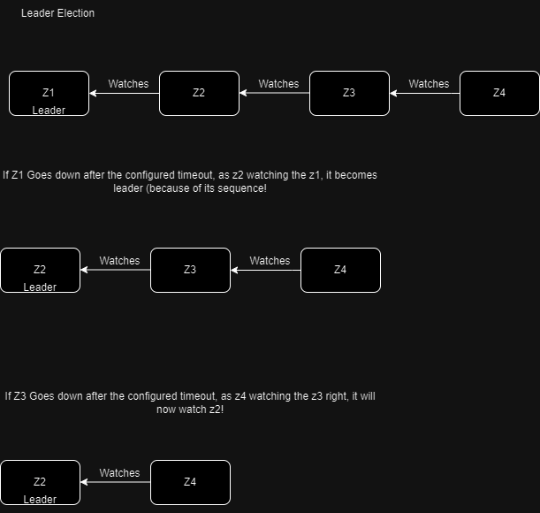
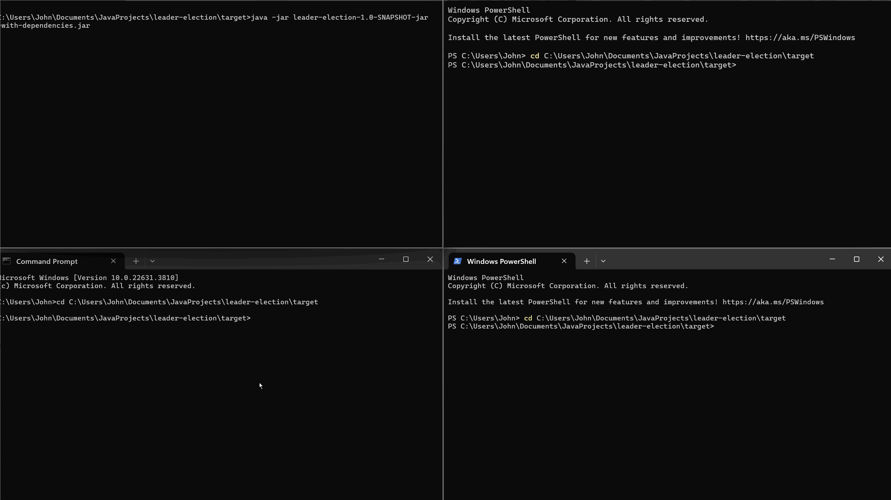

# Leader Election using Apache Zookeeper

## Overview 
This project demonstrates a leader election mechanism using Apache Zookeeper. Leader election is a common distributed systems problem where multiple nodes compete to elect a leader among them. 

Zookeeper provides a reliable way to implement leader election due to its distributed coordination service and ability to manage ephemeral sequential znodes.

## How it works

- Connects to zookeeper.
- Leader Election
    - Volunteering (Every node volunteer for leadership)
    - Leader Selection (Leasr sequence number)
    - Watcher (Watches just one before node, Solving thunder herd problem)

## Demo

## Prerequisites
- Java Development Kit
- Maven
- Apace Zookeeper installed and running locally!

## Setup and Execution
- **Zookeeper Setup:** Ensure Zookeeper is running locally on localhost:2181.
- **Build Project: ** mvn package
- **Run**: Execute java -jar leader-election-1.0-SNAPSHOT-jar-with-dependencies.jar